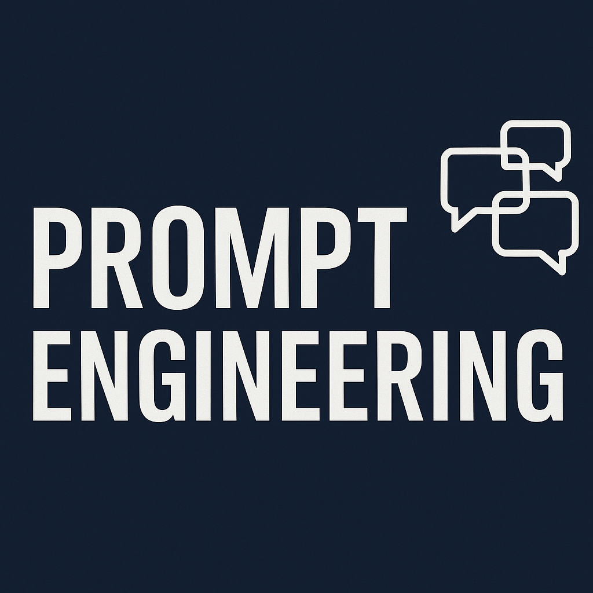

  

# 🧠 LLM Prompt Engineering Library

A curated repository of high-quality prompts, templates, and workflows for training, testing, and evaluating Large Language Models (LLMs).

Built by [Eva Paunova](https://github.com/your-profile), this repo serves as a living collection of:
- 💡 Prompt design strategies
- 🔍 Evaluation rubrics and examples
- 📊 Structured prompt datasets
- 🔧 Scripts for formatting and fine-tuning
- 📘 Templates for real-world applications (product management, education, classification, reasoning, etc.)
